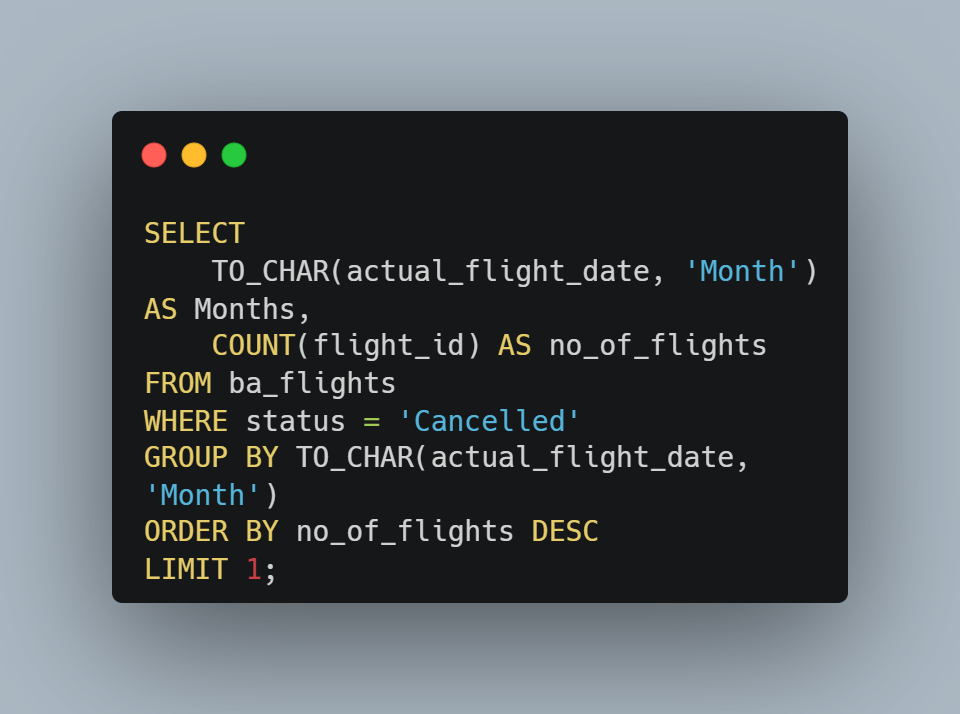
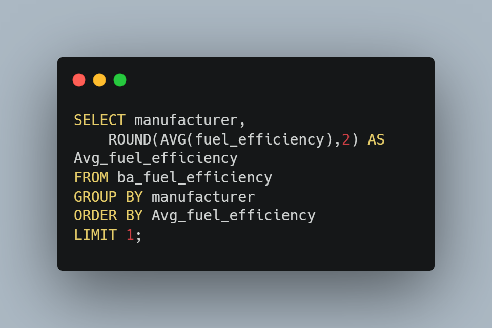
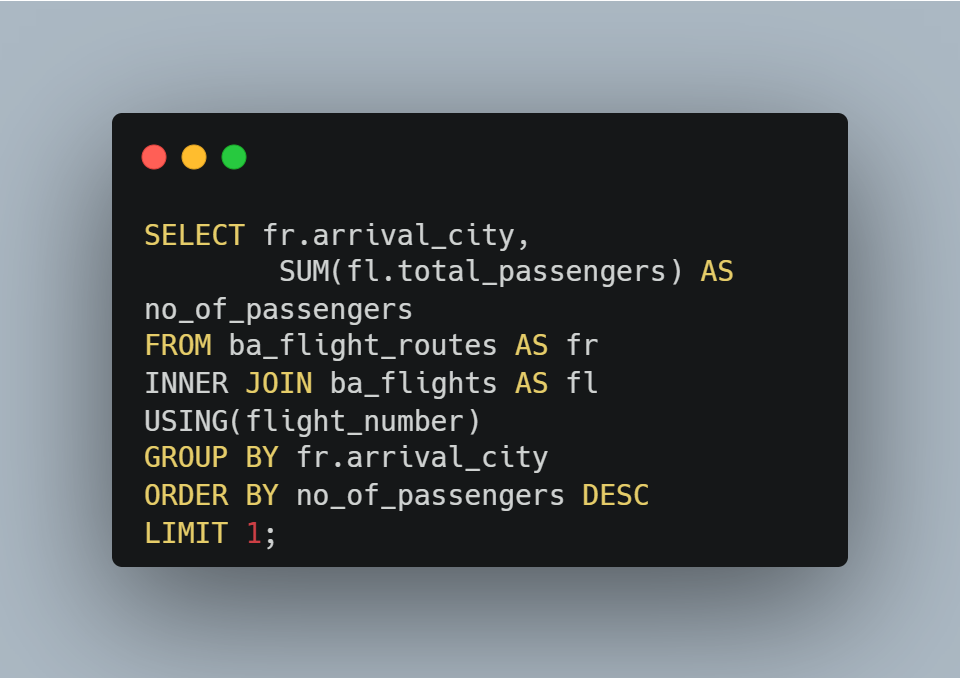
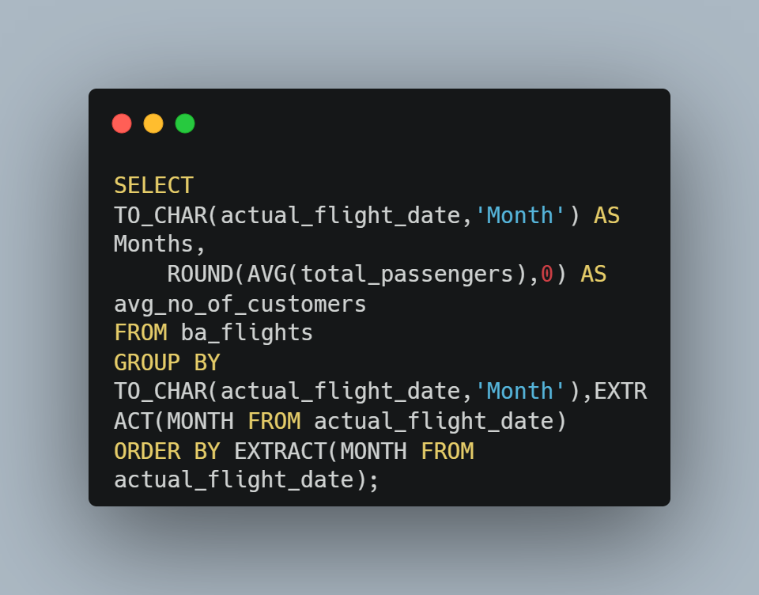
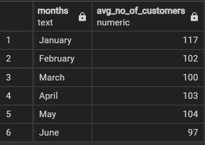
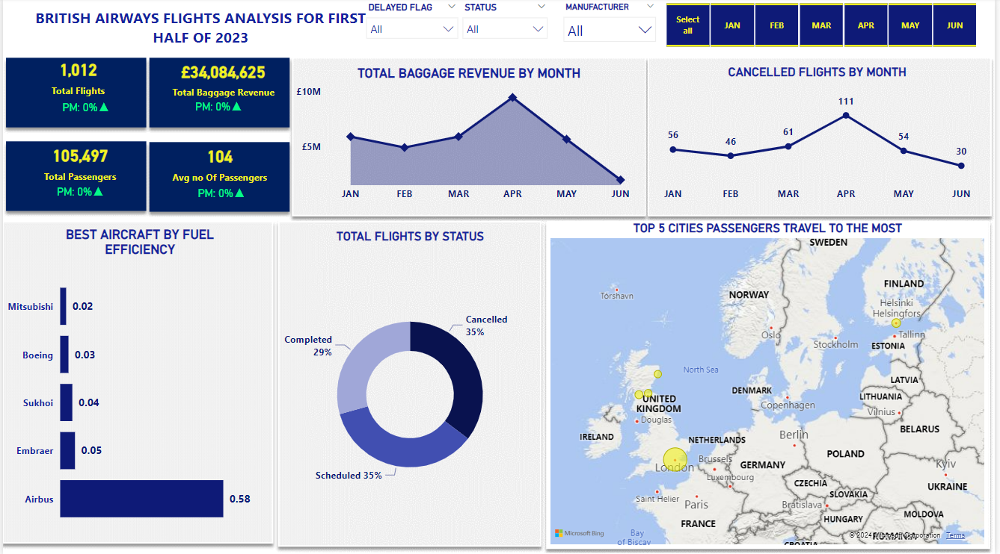
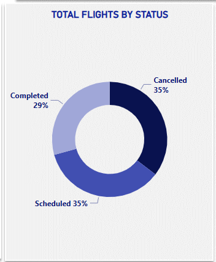
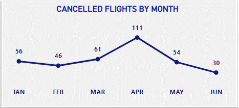
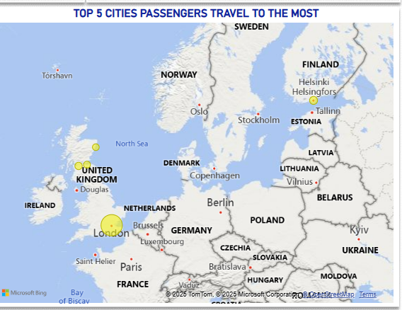

# BRITISH AIRWAYS FLIGHT ANALYSIS
## by Ebele Dakeipiri
___

___
## INTRODUCTION
___
This is a data analysis project focused on British airways flights. I made use of Excel, SQL and Power BI to explore key insights including KPI's and some important business problems.
## PROBLEM STATEMENT
British Airways is a global airline and the data generated from British Airways which includes aircratfs, flights, flight routes, fuel efficiency will be used to solve some flight assoiciated problems including;
* Which manufacturer has the best aircrafts in terms of fuel efficiency?
* Percentage of cancelled flights to completed and scheduled flights ?
* Which month did passengers cancel flights the most?
* Which city do passengers travel to the most?
* What is the revenue generated from baggage overtime?
* What is the average number of passengers like for each month?
___
## SKILLS DEMONSTRATED
##### EXCEL 
Data Cleaning: missind data were handled, duplicates removed, and dates and time were handled using excel functions including IF(ISBLANK), FIND and REPLACE, TEXT functions amongst others.
##### SQL 
The flight data was queried to solve some business problems;
* Which month did passengers cancel flights the most?

* Which manufacturer has the best aircrafts in terms of fuel efficiency?

Used Complex joins to analyze data given;
* Which city do passengers travel to the most?

Performed data aggregation;
* What is the average number of passengers like for each month?

___
## ANALYSIS AND VISUALIZATIONS
___
This project contains A report page/ Dashboard

#### Percentage of cancelled flights to completed and scheduled flights 

#### Which month did passengers cancel flights the most?

#### Which city do passengers travel to the most?

#### Which manufacturer has the best aircrafts in terms of fuel efficiency? 
After getting the averages from each aircraft fuel efficiency, Mitsubishi has the best fuel efficiency amongst the listed aircrafts, but for aircrafts used by BA, Boeing tops the list.Fuel efficiency is measured in l/km, so a lower value gives a superior efficiency because that means the aircraft uses less fuel to travel for a longer distance.From the chart, Boeing has a higher number of flights compared to other aircrafts currently used by British Airways. So on one side we can say BA uses  aircrafts from manufacturer known for their superior fuel efficiency
___
## RECOMMENDATIONS AND CONCLUSION
Here are my recommendations;
* Percentage of Cancelled Flights; British Airways need to take a survey of the various reasons that lead to these flight cancellations and device ways to improve on those reasons that are within their control while putting up contingency plans for better customer satisfaction.
* Fuel Efficiency:BA should  explore the option of including Mitsubishi to their fleets. this should be after a well vase research on other aspects of the aircraft, because this will help to reduce operating cost.
* Average Number Of passengers by Month: BA can do some service bonus to attract more passengers and also during peak seasons like festive seasons they can increase aircraft size or flight frequency to accommodate more passengers.
